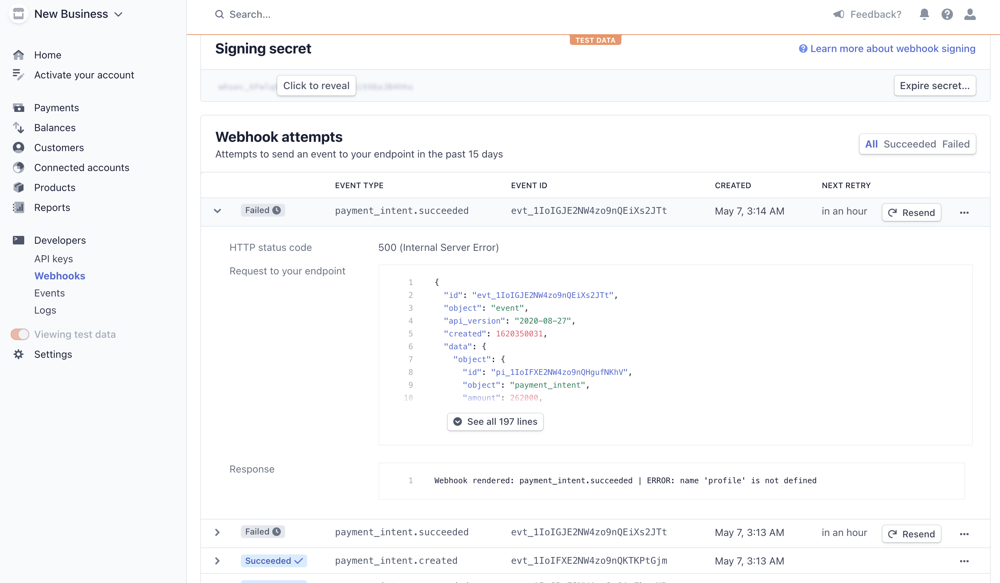

# [Decarbonify](https://github.com/Kayalvaer/decabonify_site)

## Contents
1. [Summary](#summary)
1. [UX](#ux)
    1. [Strategy](#strategy)
    1. [Scope](#scope)
    1. [Structure](#structure)
    1. [Skeleton](#skeleton)
    1. [Surface](#surface)
1. [Features](#features)
    1. [Existing Features](#existing-features)
    1. [Features left to implement](#left-to)
1. [Bugs](#bugs)
1. [Technologies used](#tech)
1. [Testing](#testing)
1. [Deployment](#deployment)
    1. [Github Pages](#github)
    1. [heroku](#heroku)
1. [Credits](#credits)
    1. [Content](#content)
    1. [Additional Content](#add-cont)
    1. [Acknowledgements](#acks)

# <a name="summary"></a> Summary
# Decarbonify site!


For the Code Institute fourth Milestone Project, I decided to develop a site for an upcoming startup

dealing with a offering a market-place for reduction of carbon emission solutions. The company will 

have a CRM site to cover the Blog and about page of the site. This part of the site will mostly cover 

the backend part and saving of static and media files on PostgreSQL and AWS S3.


View the live project here. [Decarbonify](https://decarbonify-site.herokuapp.com/)

Kindly test the adding and deletion of solutions by adding own solution and DO NOT DELETE THE ITEMS ALREADY ON THE DATABASE.
To test the functionality, you can use below details for admin testing:

* Username: kay

* Password: Leyone2011

* Email: any

Payment simulation:

* Card: 4242 4242 4242 4242 (U.S.A.)

* Date: any date in the future

* CVC/ZIP: any integers

## User Experience (UX)


* **:bookmark_tabs: Strategy Plane**

The goal is to attract potential customers to use the market place and also allow potential users to sell their products 
and Decarbonify becomes the middle man offering some of the solutions, with the hope of future expansion to offer most of the products.

The target customer will be both B2C, B2G and B2B, because of the introduction of requirements for LCA rating to trade in Europe it has become a neccessity for organisations to be aware and fighting towards acquiring zero carbon emission in our environment.

It is important that the website allows the users to search for solutions and find detailed information about the solutions. A clear structure and a modern design is also nice but mostly functionality is most important. The CRM will handle most of the advertising through the blog and alert the users of the solutions. 

Because of the time span I did not include the Blog and About page. However it can be included as a potential expansion of the project. It was important to get details of users to allow smooth communication with users their needs.

A strong brand identity to match the CRM as the site will be connected to it, is necessary and the shopping process needs to be functional and interactive.


* **:bookmark_tabs: Scope Plane**

For better interactivity the website needs to be mobile first designed and responsive to all devices.


* **:bookmark_tabs: Structure Plane**

The system should allow the user to register in order to save personal details and review their order history and edit profile details.

The possibility to complete an order without registering is available in the site especially for not complicated solutions like LCA results, or for those customers who want only a one-time solution purchase
 or simply don't want to have a personal profile on the website.

The system must allow users to search the database by entering specific words in a search box, or by just navigating the website sort list eg price, or by the given list types or just rather redirect them to the main solution categories. 

The user needs to constantly monitor the shopping wishlist status without entering the shopping bag page therefore allowing them to track their spending.

Admins can be able to access the dashboard by logging in with admin password and add products or edit them. A normal user will not be able to do such. A logged in user can also see profile history.

**Interaction design:**
* A user friendly interface to ensure usability and to encourage the user to return.
* Responsive and visible links which change on hover to provide user feedback as they navigate the site.
* Ability to pop up alerts so a user is alerted of what steps they are doing.

* **:bookmark_tabs: Information Architecture:**

* Navigation bar at the top of the page
* Responsive navigation bar - adjusting for mobile for ease of use
* Responsive images to ensure they fit within the designated spaces, no matter what device is being used or the size of the screen
* All features appropriate size and responsive for mobile and desktop viewing
* All information is appropriate and relative to the subject and not misleading or hard to find

### :computer: User stories 
## <a name="Strategy"></a> Strategy
### ** New site user's goals:**
* As a new user, I want to be able to browse and search for solutions.
* As a new user, I want to be able to view the details of the individual solutions.
* As a new user, I want to be able to understand the intent of the page
* As a new user, I want to understand easily how to navigate the page and access the solutions provided.
* As a new user, I want to be able to make a purchase without having to register a profile.
* As a new user, I want to be able to register a profile.
* As a new user, I want to be able to sort solutions on a page.
* As a new user, I want to be able to sort solutions by their specific categories.
* As a new user, I want to be able to amend the items in my basket including quantities edit them and removing them. 
  entirely
* As a new user, I want to be able to be alerted of what i select to the add to the basket.
* As a new user, I want to see images of solutions i buy so that I can be reminded of what i selected.
* As a new user, I want to get alert of whats missing when i enter form details.
* As a new user, I want to be able to see a total cost of the products am purchasing before completing the order.

### **Returning user's goals**
* As a returning user, I want to be able to log in and out.
* As a returning user, I want to be able to recover a forgotten password.
* As a returning user, I want to be able to have a personalised profile to view my historic purchases.
* As a returning user, I want to be able to edit my profile details.

### **website owner's goals:**
* As a owner, I want to be able to add, edit and delete solutions
* As a owner, I want to have the ability to add, edit and delete solutions to be limited to superusers or admin.

### Design

### Colour Scheme

The colors of the site had to match [Decarbonify site](https://decarbonify.com/) theme and the owners required a softer green color with white to show cleanness.

- # Colour scheme
  The colours that are used for the start and game over screen are:
-  #ffffff (White)
-  #28a745 (Green)
-  #36621b] (Dark green)
-  #ff4500 (dark orange)


### Typography

I choosed two fonts that are modern and highly legible: 

* Montserrat
* Sans Serif


### Imagery

Some images were used in the website and resized using [tinypng site](https://tinypng.com/) and all of them have a common 

background gradient of green or white colours, as a base colour and gives a different tone to the body.

I selected the products that I thought would fit well with the goals of this site.

The market image is from decarbonify and showing a sample of their market place that is still under development.


* **:computer: Skeleton Plan:**

The structure of the website is:

* Home Page

* Solutions by Category, price, rating

* Product Details

* Edit solutions

* Add solutions

* Blog (For future expansion proposal)

* About -Team, Mission, Vision, Location map (For future expansion proposal)

* Register

* Login

* My Profile (personal details, Purchase history)

* Wishlist or shopping basket 

* Checkout page

* Checkout Confirm page

* Manage product page (admin)

# <a name="features"></a> Features
### <a name="existing-features"></a> Existing Features

Feature | Details
--------|--------
* Responsiveness | throughout all devices.

* Menu Bar | always placed at the top of the screen on all devices. Easy for the user to navigate.

* Company Logo | inside the navbar, always visible, this is also a link to the index page.

* Toasts | to display important alerts and messages to the user (e.g. Order successfully completed, item added to bag,    signed in successfully, etc).

* Shopping bag icon | to always be visible on the menu list, with the quantity number of the products inside. Redirected users to
 the shopping basket page on a click.

* Profile icon | always visible at the menu top. Clicking on it, a dropdown appears with sub-links to other pages: "register" and "sign in" for all users,
 "my profile" for registered users and "Manage products" for admin superusers.

* Footer | always at the bottom of the page, with a summary of the most important links inside the web page, links to social media accounts,
 company information with relative information.

* Hand pointer cursor and a color change on hover | To clearly identify links.

* Add to basket or wishlist buttons | from the product detail page that allows to add the item to the shopping basket.

* Quantity (add and reload with removal) functionality | available both on product detail page and shopping basket page.

* Secure checkout button | to redirects to Stripe for safe purchase payments.


## <a name="left-to"></a> Features left to implement
Feature | Details
--------|--------
* Blog page| A page to allow users to write blogs and share relevant stories to climate change issues with the admin´s control.

* A link to information site | Important to educate the users with official sites content so that they understand the solutions better.

* A facility to sell solutions | To allow users to sell solutions if they have an agreement with decarbonify board.

* A facility to review solutions | To allow users to review offered solutions.

* Social media Login | Chance to log in using social accounts (Facebook, Instagram) and Google.

* Wishlist page | Improve styling on wishlist page, its correct on my pc but it seems django hasnt updated it (see bug sections)

* Better testing | Write tests for each app in tests.py.


### Database

For this project I have used SQLite on the local server and Postgres for deployment.


<summary>Models</summary>

### User Profile


<details>

```
class UserProfile(models.Model):
    """
    A user profile model for maintaining default
    delivery information and order history
    """
    user = models.OneToOneField(User, on_delete=models.CASCADE)
    default_phone_number = models.CharField(max_length=20, null=True, blank=True)
    default_street_address1 = models.CharField(max_length=80, null=True, blank=True)
    default_street_address2 = models.CharField(max_length=80, null=True, blank=True)
    default_postcode = models.CharField(max_length=20, null=True, blank=True)
    default_town_or_city = models.CharField(max_length=40, null=True, blank=True)
    default_country = CountryField(blank_label='Country', null=True, blank=True)
    default_county = models.CharField(max_length=80, null=True, blank=True)
```

</details>

### Category


<details>
```
class Category(models.Model):
    class Meta:
        verbose_name_plural = "Categories"

    name = models.CharField(max_length=30)
    slug = models.CharField(max_length=50, null=True, blank=True)

### Product
```
class Product(models.Model):
    category = models.ForeignKey(
        'Category', null=True, blank=True, on_delete=models.SET_NULL)
    sku = models.CharField(max_length=254, null=True, blank=True)
    name = models.CharField(max_length=160)
    description = models.TextField()
    price = models.DecimalField(max_digits=6, decimal_places=2)
    image_url = models.URLField(max_length=2000)
    image = models.ImageField(upload_to='products', null=True, blank=True)
```

</details>

### Order


<details>
```
class Order(models.Model):
    order_number = models.CharField(max_length=32, null=False, editable=False)
    user_profile = models.ForeignKey(
        UserProfile, on_delete=models.SET_NULL,
        null=True, blank=True, related_name="orders")
    full_name = models.CharField(
        default="", max_length=100, null=True, blank=True)
    email = models.EmailField(max_length=254, null=False, blank=False)
    phone_number = models.CharField(max_length=20, null=False, blank=False)
    country = CountryField(blank_label="Country *", null=False, blank=False)
    postcode = models.CharField(
        default="", max_length=20, null=False, blank=False)
    town_or_city = models.CharField(max_length=40, null=False, blank=False)
    street_address1 = models.CharField(max_length=80, null=False, blank=False)
    street_address2 = models.CharField(max_length=80, null=True, blank=True)
    county = models.CharField(max_length=80, null=True, blank=True)
    date = models.DateTimeField(auto_now_add=True)
    order_total = models.DecimalField(
        max_digits=10, decimal_places=2, null=False, default=0)
    grand_total = models.DecimalField(
        max_digits=10, decimal_places=2, null=False, default=0)
    original_bag = models.TextField(null=False, blank=False, default='')
    stripe_pid = models.CharField(
        max_length=254, null=False, blank=False, default='')
```

</details>

### Ordering Process


<details>
```
class OrderLineItem(models.Model):
    order = models.ForeignKey(
        Order, null=False, blank=False, on_delete=models.CASCADE,
        related_name='lineitems')
    product = models.ForeignKey(
        Product, null=False, blank=False, on_delete=models.CASCADE)
    product_size = models.CharField(
        max_length=2, null=True, blank=True)
    quantity = models.IntegerField(null=False, blank=False, default=0)
    lineitem_total = models.DecimalField(
        max_digits=6, decimal_places=2, null=False,
        blank=False, editable=False)
```
---
</details>


## Technologies Used

### Languages Used
* HTML5
* CSS3
* JavaScript
* JQuery
* Python 3.8.6

### Frameworks, Libraries & Programs Used

* Bootstrap 4.5.0. https://getbootstrap.com/
* Google Fonts
* Font Awesome 4.7.0.https://fonts.google.com/
* Git
* GitHub
* Vs code
* Jinja
* pip3
* Django
* Django Crispy Fields
* Django allauth
* Django countries
* Django storages
* Gunicorn
* Pillow
* Psycopg2
* Boto3
* ngrok
* Heroku
* SQLite
* Postgres
* [Django Secret Key Generator](https://miniwebtool.com/it/django-secret-key-generator/)
* Stripe
* Amazon AWS S3
* Chrome DevTools
* Balsamiq
* Favicon.ico
* Html Validator www.validator.w3.org
* CSS Validator http://www.css-validator.org/
* JSHint
* Autoprefixer CSS 9.7.6
* http://www.responsinator.com/

---

## Testing


<summary>Functionality Testing </summary>

### Functionality Testing

All the <strong>links</strong> are working.

The <strong>form</strong> validation is handled by Django and it is working.

<strong>HTML</strong> has been validated with [HTML Validator](https://validator.w3.org/) and everything was ok.

<strong>CSS</strong> has been validated with [CSS Validator](https://jigsaw.w3.org/css-validator/). 

<strong>JavaScript</strong> has been checked with [JSHint](https://jshint.com/)

For <strong>Python</strong> I used the command ```python3 -m flake8``` in my terminal to highlight all the issues in my project.
Most of the errors were too long lines and errors DJ01 ("Avoid using null=True on string-based fields").

left the ones below because they are important for the functionality:


<details>

```
./checkout/webhooks.py:28:5: F841 local variable 'e' is assigned to but never used
./checkout/webhooks.py:31:5: F841 local variable 'e' is assigned to but never used
./checkout/apps.py:8:9: F401 'checkout.signals' imported but unused
```


</details>

I successfully tested also payments using different credit cards provided by [Stripe](https://stripe.com/docs/testing#international-cards).

I checked that the payment form adapts to the credit card number:


<details>

If I enter a card that is in the U.S.A., I get the field for the ZIP code.
    
    Card Number: 4242 4242 4242 4242 | Date: any date in the future | CVC: any number | ZIP Code(example): 24242

If I enter a card that is in the U.K., I get the field for the postal code.
    
    Card Number: 4000 0082 6000 0000 | Date: any date in the future | CVC: any number | Postal Code(example): SW1W 0NY

If I enter a card that is in Australia, I don't get any additional field apart from the credit card details.
    
    Card Number: 4000 0003 6000 0006 | Date: any date in the future | CVC: any number 

I tested the authorization for the payment:

    Card number: 4000 0027 6000 3184

I tested for a invalid CVC:
     
    Card number: 4000 0000 0000 0101

I tested for insufficient founds;

    Card number: 4000 0000 0000 9995

I tested for stolen card:

    Card number: 4000 0000 0000 9979

I tested for expired card:

    Card number: 4000 0000 0000 0069


</details>

Tested webhook and got success message below: 




# <a name="testing"></a> Testing
### **New site user testing:**
# <a name="testing"></a> Testing
### **New site user testing:**


# <a name="deployment"></a> Deployment
## <a name="github"></a> Github Pages
1. Create a new repository or access an existing repository
1. Click the green Gitpod button to launch the project in Gitpod
1. Create an index.html file
1. Add the file to the staging area using the git add Functional
1. Commit the file using the git commit function, adding an appropriate commentary
1. Push the file to GitHub using the git commit and git push functions
1. Refresh your GitHub repository and click the 'Settings' tab
1. Scroll to the GitHub Pages section and select a publishing source
1. Click 'Save'
1. Click the URL created within the Settings - GitHub Pages section

**To clone the repository for local deployment:** 
1. On the main page of the repository, click the down arrow Code button
1. Click the download icon under the relevant section to clone with either HTTPS, SSH or GitHub CLI 
1. In Git Bash, change the current directory to the location you want the directory to be stored
1. Type git clone and then paste the URL you copied in step 2
    1. An example for HTTPS: `git clone https://github.com/hollyford/constant-reader`
1. Press enter - that's it, your clone has been completed! 

**To fork the repository:**
1. Navigate to the main page of the repository you wish to fork
1. Click the Fork button on the top right hand side of the page
## <a name="heroku"></a> Heroku
### How to deploy to Heroku

To deploy the app to Heroku from its [GitHub repository](https://github.com/hollyford/constant-reader), the following steps were taken:

1. From the GitPod terminal, create **requirements.txt** and **Procfile** using these commands:

```console
pip3 freeze --local > requirements.txt
echo web: python app.py > Procfile
```

2. **Push** these files to GitHub
3. **Log In** to [Heroku](https://id.heroku.com/login)
4. Select **Create new app** from the dropdown in the Heroku dashboard
5. Choose a unique name ('recipe-nation') for the app and the location nearest to you
6. Go to the **Deploy** tab and under **Deployment method** choose GitHub
7. In **Connect to GitHub** enter your GitHub repository details and once found, click **Connect**
8. Go to the **Settings** tab and under **Config Vars** choose **Reveal Config Vars**
9. Enter the following keys and values, which must match those in the settings.py file:

|**Key**|**Value**|
|:-----|:-----|
AWS_ACCESS_KEY_ID|'AWS_ACCESS_KEY_ID'
AWS_SECRET_ACCESS_KEY | 'AWS_SECRET_ACCESS_KEY'
|DATABASE_URL|'DATABASE_URL'|
|EMAIL_HOST_PASS|'EMAIL_HOST_PASS'|
|EMAIL_HOST_USER|'EMAIL_HOST_USER'|
|SECRET_KEY|'SECRET_KEY'|
|STRIPE_PUBLIC_KEY|'STRIPE_PUBLIC_KEY'|
|STRIPE_SECRET_KEY|'STRIPE_SECRET_KEY'|
|STRIPE_WH_SECRET|'STRIPE_WH_SECRET'|
|USE_AWS|True|

10. Go back to the **Deploy** tab and under **Automatic deploys** choose **Enable Automatic Deploys**
11. Under **Manual deploy**, select **master** and click **Deploy Branch**
12. Once the app has finished building, click **Open app** from the header row of the dashboard

## Credits

### :computer: Code

* [Boutique Ado from Code Institute](https://github.com/ckz8780/boutique_ado_v1) provided the base code reference for the project.

* Navbar dropdown in home page menu from https://www.youtube.com/watch?v=jEAeDID1pks

* Configuration of the application settings with heroku environment variables from https://github.com/heroku/django-heroku/issues/25 

* Shadow effect adapted from https://css-tricks.com/simulating-drop-shadows-with-the-css-paint-api/ 

* Amazon setup lead: adapted from https://django-storages.readthedocs.io/en/latest/backends/amazon-S3.html and https://www.caktusgroup.com/blog/2014/11/10/Using-Amazon-S3-to-store-your-Django-sites-static-and-media-files/

* Styling hr: code adapted from https://css-tricks.com/examples/hrs/ unfortunately failing to load the code

* Scroll Top button : adapted from https://html-online.com/articles/dynamic-scroll-back-top-page-button-javascript/ had issues to load it after transfering files to s3. Tried also https://www.w3schools.com/jsref/tryit.asp?filename=tryjsref_win_scrollto.

* Setup ngrok: https://dashboard.ngrok.com/get-started/setup and got the tip from slack.

* Placeholder image : from https://placeholder.com/.

* Some of the experienced and debugged errors: https://stackoverflow.com/questions/47065438/attributeerror-module-django-contrib-auth-views-has-no-attribute

* Heroku issue : failed to fix it but tried this https://stackoverflow.com/questions/65146909/remote-rejected-master-master-pre-receive-hook-declined-error-failed-t


### :star: Acknowledgements

Thank you to my mentor Akshat Garg for his help.

A special thanks also to the Code Institute Tutor Team, that has been always very nice helping with some issues that I faced
 during the development and when my transfer of files from Django to S3 failed for days. A big thanks to all for their patience and courtesy.

Thank you also to all that took the time to test the website.